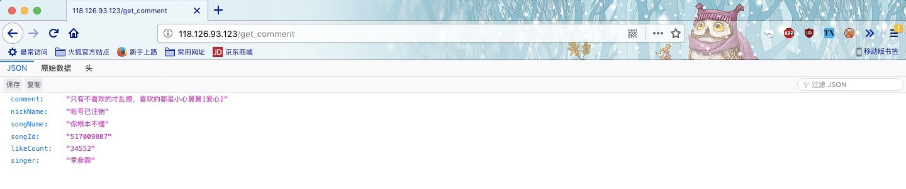

## RandomComment-API

> 本项目参考了https://github.com/xenv/gushici 项目。

* 计划开发返回png/svg格式的数据

* 目前支持网易音乐4.5万热门评论

* 计划支持[Listen-now](https://github.com/listen-now/listen-now)所支持的六大平台的热门评论

### 简介

RandomComment-API 是一个可以随机返回各大平台热门评论的接口。具有以下特点：

* 快：基于Redis数据库，确保毫秒级稳定响应。

* 全：基于[Listen-now](https://github.com/listen-now/listen-now)开源音乐平台，可提供六大平台音乐热门评论，包括网易、虾米、QQ、百度、酷狗、酷我音乐平台

* 扩展：提供返回歌曲ID，你甚至可以根据[Listen-now](https://github.com/listen-now/listen-now)项目提供的API直接返回播放歌曲所需数据

本仓库是主要实现代码，该项目是因[Listen-now](https://github.com/listen-now/listen-now)项目而产生的小项目

### 安装
目前提供数据Redis安装

1. 配置 redis，导入 dump.rdb 数据 （放到 redis 目录下，重启 redis，如果原来有这个文件请自行导出数据再替换，原有数据会全部清除）

### 使用

#### API举例

* [www.zlc666.xyz/get_comment](http://www.zlc666.xyz/get_comment)

* [API点击数统计](http://www.zlc666.xyz/count)

#### API地址格式

目前支持的后缀： json

### 技术说明

请参考Listen-now项目

### 更新历史

* 2018.08.11 0.1.0:
  1. 项目立项

### 关于项目

这是我的个人项目，同时是Listen-now而产生的小项目

数据收集整理于各大音乐平台评论，特此感谢。

若有任何建议，或者有工作实习的机会（本人大学在读），请联系 zhuyuefeng0@gmail.com

